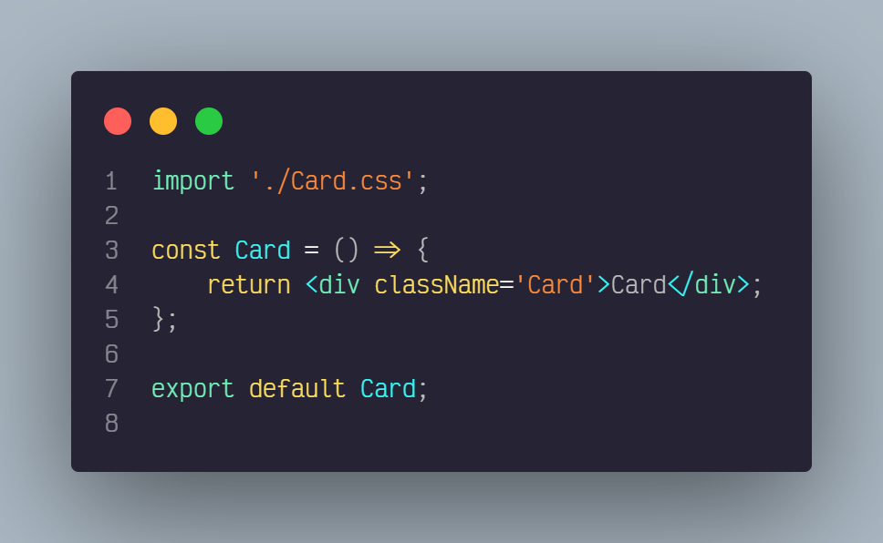
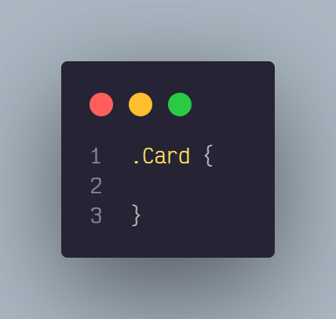

<center>
   
</center>

# React Create Component

Create your React Js components (Currently) in a fast way, with multiple variety in less than 5 seconds.

## Features

- Create a component depending on the selected language.
- Create a style file depending on the type of style or extension selected.
- You can create styles per module.
- You can create a component with built-in style import.
- It generates a barrel in your folder.
- In the tsx files, integrate the interface.

## Integrations

| Integrations         | Technologies                                  |
| -------------------- | --------------------------------------------- |
| Framework or library | [React]                                       |
| Language             | [Javascript], [Typescript]                    |
| Style extensions     | [CSS], [SASS], [SCSS]                         |
| Styles options       | [CSS Module], [styled-component], tradicional |

[React]: https://github.com/facebook/react
[CSS]: https://developer.mozilla.org/es/docs/Web/CSS
[SASS]: https://github.com/sass/sass
[SCSS]: https://github.com/sass/sass
[Typescript]: https://github.com/microsoft/TypeScript
[javascript]: https://developer.mozilla.org/es/docs/Web/JavaScript
[styled-component]: https://github.com/styled-components/styled-components
[CSS Module]: https://github.com/css-modules/css-modules

## How does it work?

### Use from a specific path


You can use it by clicking on the folder where you want your component to be and clicking on the "Create Component" option.

### Use by entering the path


You can also use it by giving it by executing the "Create Component" command from the command palette
To create a component it can also be executed with the following keys (ctrl + shift + l)

## Settings


You can make plugin settings to make component creation much faster.

## Structure Results

```routes
ComponentFolder
│
│── Component.{jsx, tsx}
│
|── styles.{css, scss, sass}
│
└── index.{js, ts}
```

## Example of output with traditional CSS

### Javascript



### css



### Barrel


### License

React Create Component is [MIT licensed](./LICENSE).
